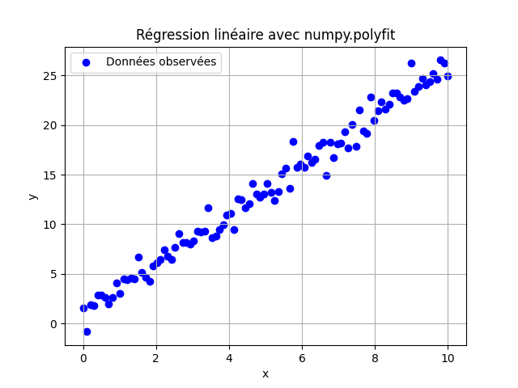
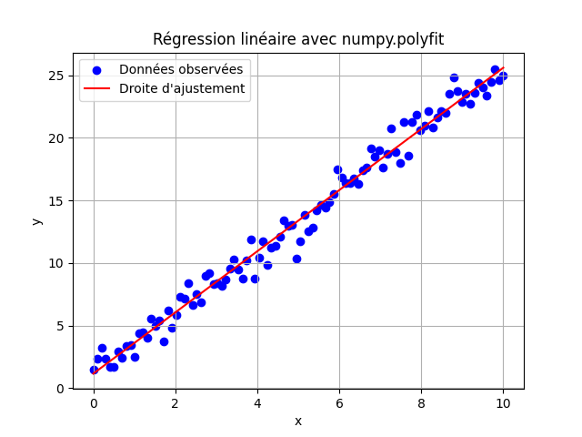

## Application 1 - Resolution d'un systeme d'équation linéaire

L'objectif de cette application est de comparer les deux méthodes, solve et cholesky, qui permettent de résoudre un système d'équations linéaires.
Dans cet exemple, on calcule l'erreur quadratique produite par chaque méthode lors de la résolution d'un système comportant 100 équations.
Les erreurs quadratiques pour les deux approches sont :
- la méthode `solve`: 2.065×10^(-22) 
- la méthode `cholesky`: 1.615×10^(-22)

Les deux méthodes produisent des erreurs quadratiques extrêmement faibles, ce qui indique qu'elles sont très précises. Cependant, l'approche de Cholesky présente une erreur légèrement inférieure dans ce cas
### Exemple de Sortie

```txt
Erreur solve: 1.0763760532707826e-27
Solution cholesky: 7.9554157101210225e-28
```
### Source Code
```python
import numpy as np

# Créer une matrice symétrique définie positive aléatoire A (10x10)
np.random.seed(42)  # Pour la reproductibilité
A = np.random.rand(100, 100) # Générer une matrice A de dimension 10 × 10 avec des valeurs aléatoires comprises entre 0 et 1

A = np.dot(A, A.T)  # Rendre la matrice symétrique et définie positive, ce qui est une condition pour utiliser la décomposition de Cholesky
# Créer un vecteur aléatoire b (10 éléments)
b = np.random.rand(100)
# Résolution en utilisant numpy.linalg.solve
x_solve = np.linalg.solve(A, b)

# Résolution en utilisant la décomposition de Cholesky
L = np.linalg.cholesky(A)
y = np.linalg.solve(L, b)       # Substitution avant
x_cholesky = np.linalg.solve(L.T, y)  # Substitution arrière

# Calculer l'erreur quadratique pour chaque méthode
error_solve = np.linalg.norm(np.dot(A, x_solve) - b)**2
error_cholesky = np.linalg.norm(np.dot(A, x_cholesky) - b)**2

print(f"Erreur quadratique pour solve: {error_solve}")
print(f"Erreur quadratique pour cholesky: {error_cholesky}")

```

## Application 2 - Regression linéaire

On dispose de deux ensembles de 100 valeurs chacuns représentant la relation entre des valeurs x et y. L'objectif est de trouver une droite d'ajustement y=ax+b qui minimise l'erreur quadratique entre les points observés et les valeurs prédites.

### Exemple
* Données d'exemple


* Résultats
    ```textmate
    Pente (a) : 2.539790699368742
    Ordonnée à l'origine (b) : 0.7469321387354177
    ```
            
### Source Code
```python
import numpy as np
import matplotlib.pyplot as plt

# Données d'exemple
x = np.linspace(0, 10, 100) # Valeurs de x
# Générer les valeurs de y en utilisant une relation linéaire avec du bruit aléatoire
true_slope = 2.5  # Pente réelle
true_intercept = 1.0  # Intercept réel
noise = np.random.normal(0, 1, size=x.shape)  # Bruit aléatoire

# Valeurs observées de y
y = true_slope * x + true_intercept + noise
# Ajustement linéaire avec numpy.polyfit
coefficients = np.polyfit(x, y, 1)  # Degré 1 pour une régression linéaire
a, b = coefficients  # a = pente, b = ordonnée à l'origine

# Générer les valeurs prédites
y_pred = a * x + b

# Affichage des résultats
print(f"Pente (a) : {a}")
print(f"Ordonnée à l'origine (b) : {b}")

# Tracé des points et de la droite d'ajustement
plt.scatter(x, y, color="blue", label="Données observées")  # Points
plt.plot(x, y_pred, color="red", label="Droite d'ajustement")  # Droite
plt.xlabel("x")
plt.ylabel("y")
plt.title("Régression linéaire avec numpy.polyfit")
plt.legend()
plt.grid()
plt.show()
```
